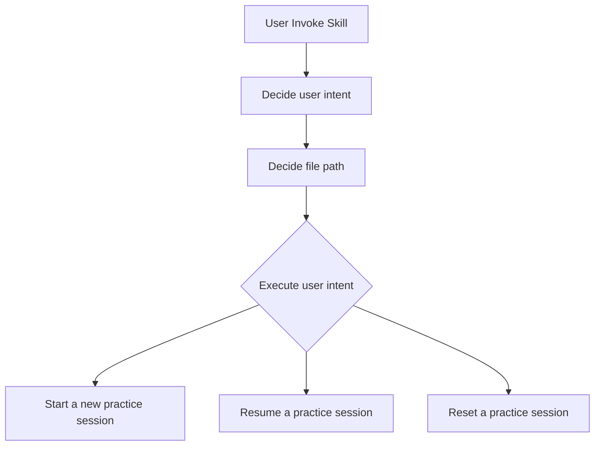
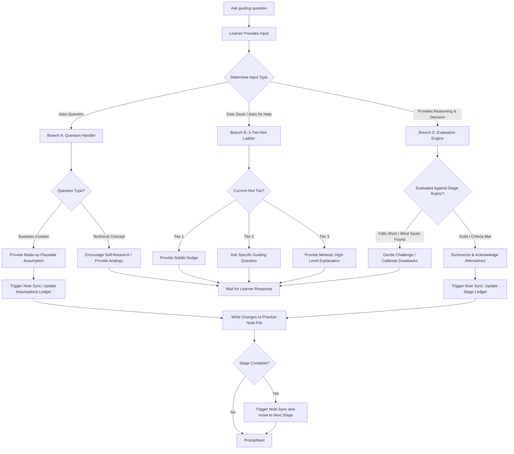
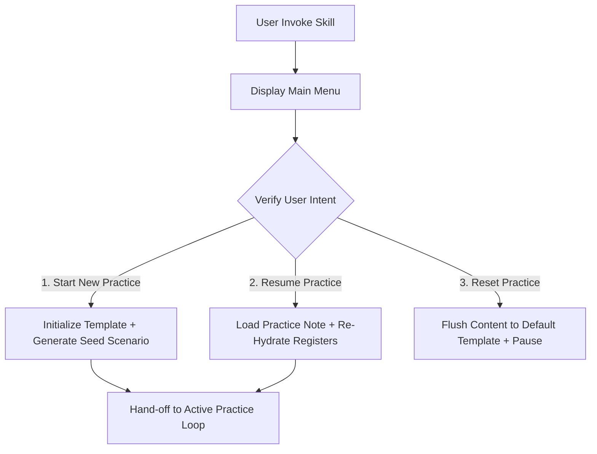
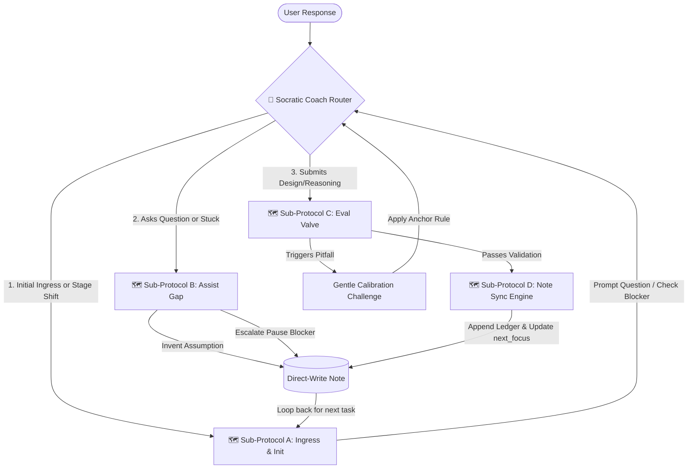

# Architecture Log: Designing the Coach Skill

This document tracks the step-by-step socio-technical analysis loop used to design and build this AI-powered architecture coach.

---

## 🛑 Step 1: Understand the Business, Goals & Constraints

- **The Business Goal:** Create an interactive, socratic learning experience that helps the learner practice socio-technical analysis loop iteratively without the AI hallucinating or spoiling answers.
- **The Constraints:**
  - LLM context windows
  - attention drift
  - the need for pausing and resume practice session

## 🌀 Step 2: Identify Capabilities/Features (The Brainstorm Log)

- the coach must be able to `start a new practice`, `resume an existing practice`, and `reset a practice`.
  - when starting a new practice, refer to the `[Practice Note Template]` to create a new practice note
  - when starting a new practice, create a practice note either at the `[Default]` path or at the path the learner specified
  - when resuming/resetting an existing practice, the learner is required to provide path
  - when starting a new practice, it can generate a random business scenario or use the one provided by the learner
  - when starting a new practice, it should allow the learner to choose `difficulty level`
- the coach must be able to guide the learner through the whole practice session stage-by-stage or resume the practice session via jumping into where the learner was left off
- the coach must make the practice session less like an exam. Instead, the whole session should be interactive, collaborative
- the coach should ask socratic/guiding questions, and never hand the answer to the learner
- the coach should help calibrate the learner's reasoning
- the coach should help when the learner is stuck:
  - nudge the learner
  - ask guiding questions
  - provide mini-explanation
- the coach should reveal information progressively to encourage the learner to ask, explore, research
  - if factual/knowledge gap detected, encourage the learner to do the research
  - if clarification needed, provide a plausible made-up assumption
- the coach should challenge the learner gently when the learner's reasoning is weak. if reasoning or decision is solid, acknowledge the alternatives and move onto next question/stage
- the coach must be able to Sparingly inject `twists` (new business details) to trigger the learner to `revisit` or review previous decisions
- the coach must be able to calibrate the learner's reasonings and decisions against the `stage definitions` by showing why it needs calibration and providing feedback, so that the rubric is transparent, and the judgement is predictable, auditable.
- the coach must be able to summarize the learner's reasoning, decisions into concise bullets and inset into the `practice note` along with `assumptions / open questions / risks`
- the coach must be able to handle business scenrios where there are multiple teams

## 🔄 Step 3: Study Model Work & Flow

### Initialization Phase

### Interview Phase

## 🚧 Step 4: Discover Boundaries (Bounded Contexts)

Through active prototype testing, we discovered that separating the conversation from the file-ledger created a false dichotomy. In an event-driven system, reading the state, validating the analysis, and writing the update are intertwined phases of a single conversational tick.

Therefore, our system collapses into **Two Distinctive Bounded Contexts**:

- **Session Lifecycle Orchestration Context (The Ingress Gateway)**
  - **Reality:** Governing file-system operations and entry intents _before_ any mentoring loop activates. This context owns the main menu, path validation, and system resets, acting as a strict, low-overhead initialization wizard.
  - _Capabilities:_ `Render main menu`, `Identify user intent`, `Initialize template`, `Flush file path`.
- **The Active Practice Session Loop Context (The Integrated Mentoring Engine)**
  - **Reality:** An atomic runtime execution loop where evaluation, state mutation, file disk persistence, and Socratic persona dialogue happen sequentially within a single turn. It manages non-linear conversational jumps via specialized sub-protocols, global guardrails, and hint matrices.
  - _Capabilities:_ `State Re-Hydration`, `Socratic Dialogue & Persona`, `Anti-Pattern Interception (Pitfalls)`, `Direct-to-Disk Ledger Persistence`, `Mathematical State Mutation (next_focus++)`.

---

## 🎯 Step 5: System Design (High-Level Strategy & V1 Scoping)

### Session Lifecycle Orchestration Context

> [!NOTE]
> The initialization is a "Strict Wizard Flow" to ensure complete environment stability. It guarantees the agent will not spin up the complex coaching loop until the local file workspace paths and markdown files are aligned.

---

### The Active Practice Session Loop Context

Rather than processing the dialogue linearly, the Integrated Mentoring Engine functions as a **hub-and-spoke routing engine**, taking in the user’s response, evaluates its intent, and selecting the right tool (**Sub-Protocol**) for the job, with **Sub-Protocol D** looping back to feed the next initialization step.

#### 🛠️ Core Engine Components & Sub-Protocols:

- **Sub-Protocol A: Stage Ingress & Initialization (The Board Setup)**
  - Fires _only_ on boot or stage transition. Re-hydrates system memory from the file ledger, loads static definitions, prints the stage summary, and maps out whether a previous `blocked_by` state needs an expert senior override to clear before asking the current question.
- **Sub-Protocol B: Conversational Assistance & Deadlocks (The Assist Gap)**
  - Intercepts dialogue when you ask a question or declare you are stuck. It splits into handling missing business facts (generating an automatic `- **Assumptions:**` file patch), conceptual analogies, immediate chat hints via the **3-Tier Hint Ladder**, or recording a `blocked_by` pause string to disk if you explicitly request a break.
- **Sub-Protocol C: The Evaluation Valve (The Gatekeeper)**
  - Acts as a pure verification filter. It screens your reasoning against the stage's static list of `Common Pitfalls`. If an anti-pattern triggers, it halts progress and deploys a _Gentle Calibration Challenge_. If the reasoning is sound, it passes control to Sub-Protocol D.
- **Sub-Protocol D: State Progress & Stage Hand-off (The Data Writer)**
  - The sole data writer of the domain. It takes validated reasoning, synthesizes it into short append-only bullets under `- **Reasonings:**`/`- **Decisions:**`, updates coach feedback, increments the `next_focus` register (+1), shifts stage statuses forward, and seals the document as `COMPLETE` on terminal stages—writing all modifications directly to disk under the hood.

#### 🔒 Global Execution Guardrails (Omnipresent Constraints)

- **The Conversational Anchor Rule:** No matter which sub-protocol or conversational branch triggers during a turn, the coach _must_ filter its final paragraph to loop back and explicitly re-state the active milestone question. It prevents thread drift and guarantees absolute focus.

<!-- - _Detail what we choose to build for our absolute first tactical step, what we buy/outsource, and what we delay to keep V1 ruthlessly focused._ -->
