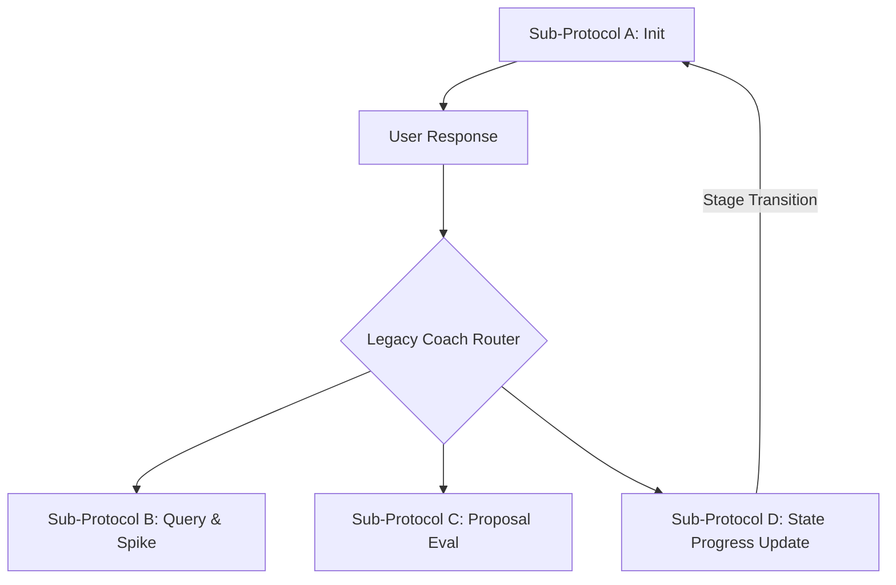
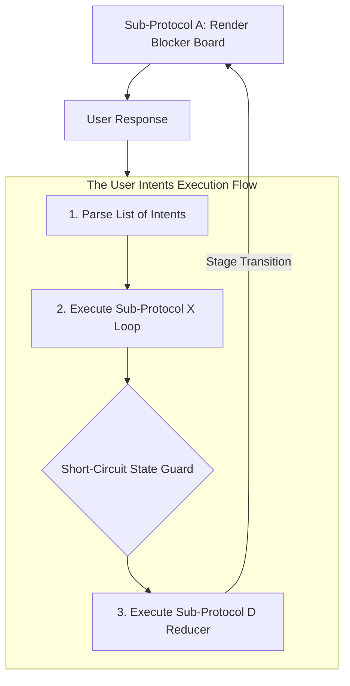
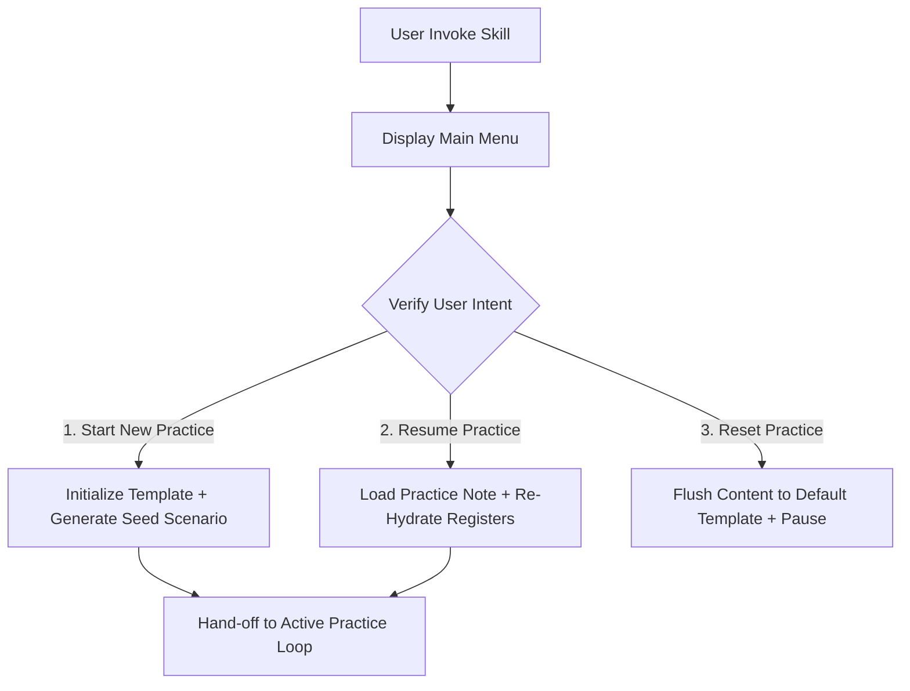
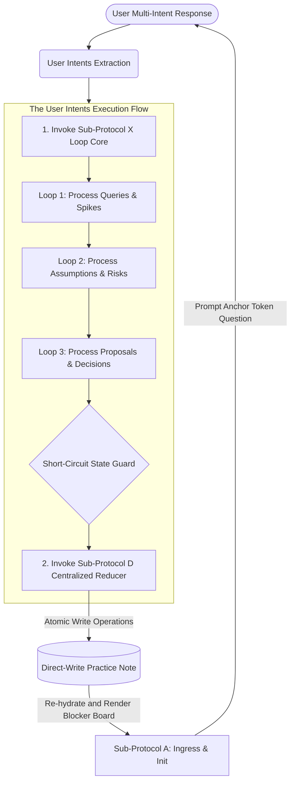

# Architecture Log: Designing the Coach Skill

This document tracks the step-by-step socio-technical analysis loop used to design and build this AI-powered architecture coach.

---

## 🛑 Step 1: Understand the Business, Goals & Constraints

- **The Business Goal:** Create an interactive, socratic learning experience that helps the learner practice socio-technical analysis loop iteratively while preventing the AI hallucination or spoiling answers.
- **The Constraints:**
  - LLM context windows
  - Attention drift
  - The need for pausing and resuming practice sessions

---

## 🌀 Step 2: Identify Capabilities/Features (The Brainstorm Log)

- The coach must be able to `start a new practice`, `resume an existing practice`, and `reset a practice`.
  - When starting a new practice, refer to the `[Practice Note Template]` to create a new practice note.
  - When starting a new practice, create a practice note either at the `[Default]` path or at the path the learner specified.
  - When resuming/resetting an existing practice, the learner is required to provide the path.
  - When starting a new practice, it can generate a random business scenario or use the one provided by the learner.
  - When starting a new practice, it should allow the learner to choose a `difficulty level`.
- The coach must be able to guide the learner through the whole practice session stage-by-stage or resume the practice session via jumping into where the learner was left off.
- The coach must make the practice session less like an exam. Instead, the whole session should be interactive, collaborative.
- The coach should ask socratic/guiding questions, and never hand the answer to the learner.
- The coach should help calibrate the learner's reasoning under a strict **Single-Hint-Then-Solve** workflow to manage conversation velocity.
- The coach should handle multi-intent user responses dynamically inside a single turn without dropping adjacent input or auto-resolving untouched issues.
- The coach should reveal information progressively to encourage the learner to ask, explore, and research.
  - If a factual/knowledge gap is detected, encourage the learner to do the research.
  - If clarification is needed, provide a plausible made-up assumption.
- The coach should challenge the learner gently when the learner's reasoning is weak. If reasoning or decision is solid, acknowledge the alternatives and move onto the next question/stage.
- The coach must be able to summarize the learner's valid reasoning and decisions into concise bullets and insert them into the `practice note` while routing expert coach resolutions exclusively to a distinct learnings ledger.

---

## 🔄 Step 3: Study Model Work & Flow

### V1 MVP Architecture (Legacy Hub-and-Spoke)

Our initial implementation relied on a linear Hub-and-Spoke model where sub-protocols were triggered as independent conditional branches based on a singular assumed intent. This failed to scale when a user provided a compound response (e.g., answering a question while simultaneously making a flawed assumption).

### V2 Production Architecture (Sequential Intent-Loop Pipeline)

The engine was refactored into an isolated transaction pipeline. User input is parsed as a collection of sequential intents (`[query] -> [assumption] -> [proposal]`) inside a stateless short-term memory processor (`Sub-X`), protected by an ironclad **Short-Circuit State Guard** before committing changes directly to disk via a centralized writing reducer (`Sub-D`).

---

## 🚧 Step 4: Discover Boundaries (Bounded Contexts)

Through active prototype testing, we discovered that separating the conversation from the file-ledger created a false dichotomy. In an event-driven system, reading the state, validating the analysis, and writing the update are intertwined phases of a single conversational tick.

Therefore, our system collapses into **Two Distinctive Bounded Contexts**:

- **Session Lifecycle Orchestration Context (The Ingress Gateway)**
  - **Reality:** Governing file-system operations and entry intents _before_ any mentoring loop activates. This context owns the main menu, path validation, and system resets, acting as a strict, low-overhead initialization wizard.
  - _Capabilities:_ `Render main menu`, `Identify user intent`, `Initialize template`, `Flush file path`.
- **The Active Practice Session Loop Context (The Integrated Mentoring Engine)**
  - **Reality:** An atomic runtime execution loop where intent parsing, constraint checking, state mutation, file disk persistence, and Socratic persona dialogue happen sequentially within a single turn. It manages non-linear conversational jumps via specialized prefix tokens (`flaw:*`, `pitfall:*`, `milestone:*`) stored in a single unified `blocked_by` array primitive.
  - _Capabilities:_ `State Re-Hydration`, `Socratic Dialogue & Persona`, `Intent Isolation Checking`, `Direct-to-Disk Ledger Persistence`, `Atomic State Mutation`.

---

## 🎯 Step 5: System Design (High-Level Strategy & Pipeline Gating)

### Session Lifecycle Orchestration Context

### The Active Practice Session Loop Context

Rather than processing the dialogue as a hub-and-spoke choice, the Integrated Mentoring Engine functions as an **atomic transaction pipeline**. It ingests the multi-intent user response, routes each component sequentially through individual memory loop filters (`[query] -> [assumption] -> [proposal]`) inside **Sub-Protocol X**, applies the **Short-Circuit State Guard**, and defers all physical note updates to the centralized write reducer (**Sub-Protocol D**).

#### 🛠️ Core Engine Components & Sub-Protocols:

- **Sub-Protocol A: Stage Ingress & Initialization (The Blocker Board UI)**
  - Fires _only_ on a new session boot, a resumed session, or a stage transition. It re-hydrates the conversational memory from the file ledger, dynamically prints stage objectives, and renders the unified **Active Blockers Board** categorized into distinct tracking slots to transparently show what is holding up macro progression [XP].
- **Sub-Protocol X: Sequential Intent Processing Pipeline (The Headless Evaluator)**
  - The pure, stateless processing engine operating completely within short-term memory [XP]. It streams parsed user intent tags sequentially, evaluates them against the active business context and stage pitfalls, and applies our strict **Single-Hint-Then-Solve Strategy** to prevent learner stagnation [XP].
- **Sub-Protocol D: State Progress & Stage Hand-off (The Centralized Reducer)**
  - The single application write-barrier and state reducer for the entire workspace domain [XP]. It reads the headless calculations compiled by Sub-X, flushes append-only text mutations straight to the markdown note placeholders, overwrites the array-based YAML block to ensure file alignment, and increments the macro milestone tracking state [XP].

#### 🔒 Global Execution Guardrails (Omnipresent Constraints)

- **The Strict Intent Isolation Rule:** A tracking token inside the `blocked_by` list can _only_ be updated or removed if the incoming user intent explicitly targets or directly responds to that specific category of blocker. If an intent is completely silent on a pending flaw, that token remains locked in the array, forcing a continued conversational freeze.
- **The Short-Circuit State Guard:** If any conceptual spike, structural flaw, or improper design pitfall is active in the `blocked_by` array, the engine is strictly forbidden from clearing or popping the active `milestone:key_question_*` token on that turn. Progression remains frozen, data writes are rejected, and the conversation anchors exactly onto the unaddressed friction point.
