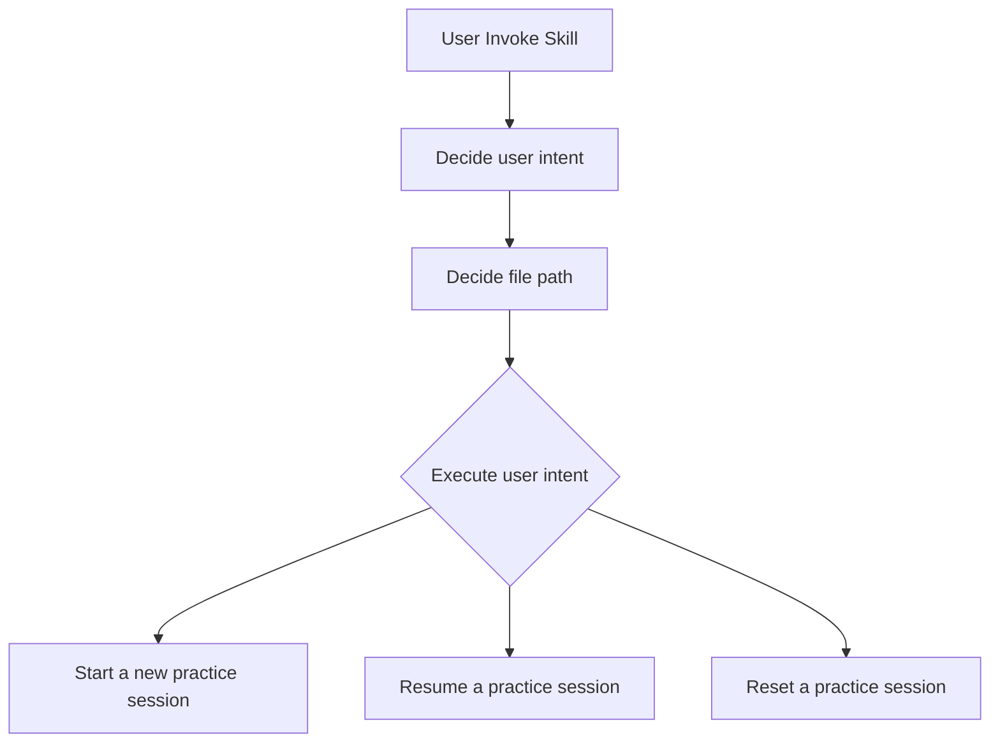
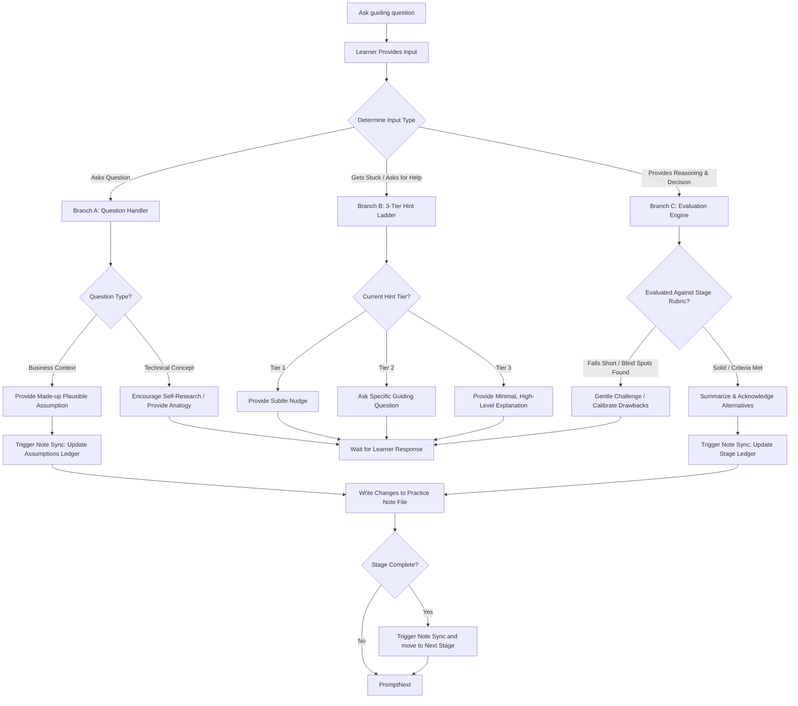
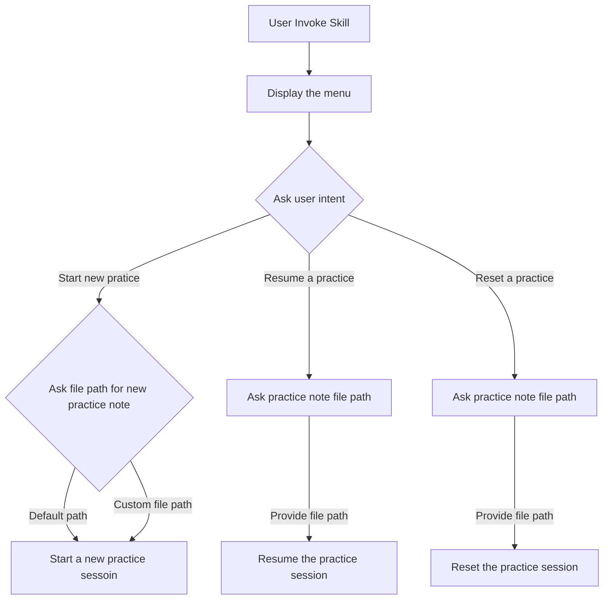

# Architecture Log: Designing the Coach Skill

This document tracks the step-by-step socio-technical analysis loop used to design and build this AI-powered architecture coach.

---

## 🛑 Step 1: Understand the Business, Goals & Constraints

- **The Business Goal:** Create an interactive, socratic learning experience that helps the learner practice socio-technical analysis loop iteratively without the AI hallucinating or spoiling answers.
- **The Constraints:**
  - LLM context windows
  - attention drift
  - the need for pausing and resume practice session

## 🌀 Step 2: Identify Capabilities/Features (The Brainstorm Log)

- the coach must be able to `start a new practice`, `resume an existing practice`, and `reset a practice`.
  - when starting a new practice, refer to the `[Practice Note Template]` to create a new practice note
  - when starting a new practice, create a practice note either at the `[Default]` path or at the path the learner specified
  - when resuming/resetting an existing practice, the learner is required to provide path
  - when starting a new practice, it can generate a random business scenario or use the one provided by the learner
  - when starting a new practice, it should allow the learner to choose `difficulty level`
- the coach must be able to guide the learner through the whole practice session stage-by-stage or resume the practice session via jumping into where the learner was left off
- the coach must make the practice session less like an exam. Instead, the whole session should be interactive, collaborative
- the coach should ask socratic/guiding questions, and never hand the answer to the learner
- the coach should help calibrate the learner's reasoning
- the coach should help when the learner is stuck:
  - nudge the learner
  - ask guiding questions
  - provide mini-explanation
- the coach should reveal information progressively to encourage the learner to ask, explore, research
  - if factual/knowledge gap detected, encourage the learner to do the research
  - if clarification needed, provide a plausible made-up assumption
- the coach should challenge the learner gently when the learner's reasoning is weak. if reasoning or decision is solid, acknowledge the alternatives and move onto next question/stage
- the coach must be able to Sparingly inject `twists` (new business details) to trigger the learner to `revisit` or review previous decisions
- the coach must be able to calibrate the learner's reasonings and decisions against the `stage definitions` by showing why it needs calibration and providing feedback, so that the rubric is transparent, and the judgement is predictable, auditable.
- the coach must be able to summarize the learner's reasoning, decisions into concise bullets and inset into the `practice note` along with `assumptions / open questions / risks`
- the coach must be able to handle business scenrios where there are multiple teams

## 🔄 Step 3: Study Model Work & Flow

### Initialization Phase

### Interview Phase

## 🚧 Step 4: Discover Boundaries (Bounded Contexts)

In this case, we have **One Actor** -- the learner who invokes the skill, and **One Overarching Domain**(`Coaching`), the language doesn't split.

For Context discovery, we drew boundaries based on **Three Distinctive Operational Realities**:

- **Session Lifecycle Orchestration Context**
  - When the user wakes up the skill, they aren't interviewing, and they aren't evaluating an architectural decision yet. They are performing session lifecycle management (routing, file checks, and menu rendering). Trying to force the Interviewing Context to handle menu logic or file path validation would violate the Single Responsibility Principle.
    - `Render main menu`
    - `Identify the user intent`
    - `Validate file path (practice note)`
- **Socratic Interviewing Context**
  - **The Dialogue Boundary (Volatile/Creative)**: This space handles the human interaction. It is temporary, conversational, and changes with every message you type. It needs a flexible, fluid cognitive model.
    - `Manage the persona`
    - `The socratic back-and-forth`
    - `The progressive reveal`
- **State Evaluation & Note Sync**
  - **The State Ledger Boundary (Immutable/Structured)**: This space handles the data contract. It must be highly disciplined, predictable, and rigidly formatted so it doesn't corrupt your markdown files or state machines.
    - `Validate exit criteria`
    - `Format the markdown schema`
    - `Rewrite the practice note`

<!-- - _Explain how the capabilities were split into the "Socratic Dialogue Context" (volatile/conversational) and the "State Evaluation & Sync Context" (rigid/immutable data ledger)._ -->

## 🎯 Step 5: System Design (High-Level Strategy & V1 Scoping)

### Session Lifecycle Orchestration Context

> [!NOTE] The initialization is designed to be a "Strict Wizard Flow" -- where the agent takes complete control of the ingress conversation.
>
> - Zero Parsing Overhead: The agent doesn't have to interprete the user prompt. It explicitly prompts for exactly what it needs, one question at a time.
> - Lower Cognitive Load: as the user, you don't have to remember a special syntax to invoke the coach. You just invoke the skill, and the wizard takes the wheel.
> - Predictable Execution: Since the agent drives the sequence, it guarantees it will not enter the coaching loop until the workspace files are perfectly aligned.

**Alternative Designs:**

- Design: Mapping out every combination of the user inputs:
  - `intent, no file path`
  - `no intent, file path`
  - `no intent, no file path`
  - `intent, file path`
  - `...`

- Problem: **State Space Explosion**
  - the whole logic will quickly turn into a fragile maze of `if/else` statements
  - because the agent skill is written in markdown format, letting the LLM navigate an unguided matrix of inputs will lead to inconsistent behavior and routing bugs.

---

### Socratic Interviewing Context

- The **Coach** Persona:
  - Collaborative
  - Progressive reveal
  - Never hand answers
  - Always encourage learner to think, explore, research
- The **Three** dialogue branches:
  - Branch A: [Learner Asks Questions]
    - The Context: The learner asks for clarification on the business scenario, or asks for a technical definition.
    - The Coach's Strategy:
      - If it's about Business Context: The coach must dynamically act as the "Product Owner/Client" and provide a realistic, reasonable assumption that fits the narrative (`which leads to the Note Sync`).
      - If it's about Technical/Architectural concepts: The coach encourages the learner to do research.
  - Branch B: [Learner Gets Stuck]
    - The Context: The learner asks "I don't know" or "I'm stuck".
    - The Coach's Strategy:
      - The 3-Tier Hint Ladder: the coach will help the learner in a progressive way: `nudge -> a guiding question -> a minimal explanation`, which guarantees the coach never over-helps too early. It lets the human cognitive muscle stretch as much as possible before stepping in.
  - Branch C: [Learner Reasons + Decisions]
    - The Context: The learner provides analysis, or declare a design decision.
    - The Coach's Strategy (`The Gatekeeper`): refer to [Evaluation & Note Sync](#evaluation--note-sync)

---

### Evaluation & Note Sync

> [!Note] in V1, We will only focus on the part:`stage 1` for both `Practice Note Template` and `Stage Definition`.

- The `Practice Note` generation
- The Coach's Strategy (`The Gatekeeper`): Evaluating the learner's `Reasoning + Decision`
  - The coach evaluates the learner's reasoning against the `stage definition`'s **Exit Criteria Rubric**.
  - If it falls short: It gently challenges you by highlighting a friction point or asking about a drawback.
  - If it passes: It acknowledges the solid choice, summarizes the learner's reasoning and decision along with coach feedback, and updates the _practice note_ (`which leads to the Note Sync`).
- When coach provides a made-up assumption, lock it in by updating the _practice note_ automatically before presenting it to the learner
- When the current stage is accomplished, coach should save the progress by updating the _practice note_ automatically

<!-- - _Detail what we choose to build for our absolute first tactical step, what we buy/outsource, and what we delay to keep V1 ruthlessly focused._ -->
